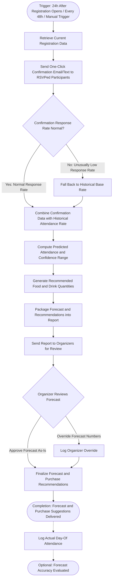

# Workflow of Tasks

*Replace all bracketed prompts with information specific to your proposed system. Delete instructional text that does not belong in your final specification. Add or remove task sections as needed. Every task shown in the general workflow must have a corresponding task specification below.*

## 1. Workflow Overview
### 1.1 Workflow Goal
This workflow supports the system goal defined in `my_first_agent/README.md`.

### 1.2 Workflow Trigger

The workflow begins 24 hours after event registration opens, and runs again every 48 hours based on the updated registration information. Organizers can also manually trigger the workflow.

### 1.3 Completion Condition at Runtime

The workflow is completed once the agent has produced a predicted attendance outcome with a confidence interval, as well as suggestions for the resources that need to be purchased for the event. The overall workflow (across runs) is considered complete once the final forecast has been delivered and, optionally, actual day-of attendance has been logged to evaluate forecast accuracy.

### 1.4 General Workflow

For the normal path, the system retrieves the current registration data (from survey RSVPs) and sends a one-click follow-up confirmation email or text to people who have already RSVPed. The system combines the current registration data with historical attendance-rate data (like the ~40% baseline from the last build event) to compute a predicted attendance number with a confidence range. This forecast, along with a recommended quantity of food and drinks, is packaged into a short report and sent to organizers for review.

One exception path may result from unusually low confirmation response rates, in which case the system falls back to historical base rates. There will be a human-review checkpoint before the final forecast is sent, where organizers can manually adjust the numbers based on their own judgment before finalizing purchases. If organizers override the forecast, the override and final actual attendance are logged to help calibrate future predictions.

### 1.5 Workflow Diagram

