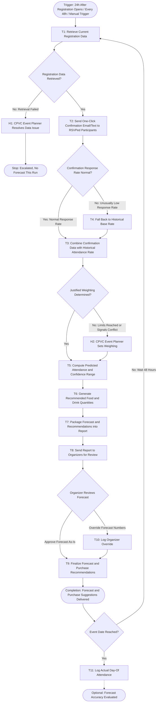

# Workflow of Tasks

## 1. Workflow Overview
### 1.1 Workflow Goal
This workflow supports the system goal defined in `my_first_agent/README.md`.

### 1.2 Workflow Trigger

The workflow begins 24 hours after event registration opens, and runs again every 48 hours based on the updated registration information. Organizers can also manually trigger the workflow.

### 1.3 Completion Condition at Runtime

The workflow is completed once the agent has produced a predicted attendance outcome with a confidence interval, as well as suggestions for the resources that need to be purchased for the event. The overall workflow (across runs) is considered complete once the final forecast has been delivered and, optionally, actual day-of attendance has been logged to evaluate forecast accuracy.

### 1.4 General Workflow

For the normal path, the system performs **T1: Retrieve Current Registration Data** (from survey RSVPs) and **T2: Send One-Click Confirmation Email/Text to RSVPed Participants**, which records the responses it collects. **T3: Combine Confirmation Data with Historical Attendance Rate** blends the confirmation data with historical attendance-rate data (like the ~40% baseline from the last build event). **T5: Compute Predicted Attendance and Confidence Range** turns that blend into a predicted attendance number with a confidence range, and **T6: Generate Recommended Food and Drink Quantities** converts the forecast into purchase quantities. **T7: Package Forecast and Recommendations into Report** and **T8: Send Report to Organizers for Review** deliver a short report to organizers.

One exception path results from unusually low confirmation response rates, in which case the system performs **T4: Fall Back to Historical Base Rate** before T3. If T1 cannot retrieve the registration data, the run stops and the CPVC Event Planner is asked to resolve the data issue; no forecast is produced from missing data. If T3 cannot determine a justified weighting within its limits, it hands the case to the CPVC Event Planner, who sets the weighting before T5 continues.

There is a human-review checkpoint before the final forecast is sent, where organizers can approve the forecast or manually adjust the numbers based on their own judgment before **T9: Finalize Forecast and Purchase Recommendations**. If organizers override the forecast, **T10: Log Organizer Override** records the override. After each run, the workflow waits 48 hours and repeats from T1 until the event date. After the event, **T11: Log Actual Day-Of Attendance** records actual attendance so forecast accuracy can be evaluated and future predictions calibrated.

### 1.5 Workflow Diagram

```mermaid
flowchart TD
    Trigger(["Trigger: 24h After Registration Opens / Every 48h / Manual Trigger"]) --> T1["T1: Retrieve Current Registration Data"]
    T1 --> D0{"Registration Data Retrieved?"}
    D0 -->|"No: Retrieval Failed"| H1["H1: CPVC Event Planner Resolves Data Issue"]
    H1 --> E1(["Stop: Escalated, No Forecast This Run"])
    D0 -->|"Yes"| T2["T2: Send One-Click Confirmation Email/Text to RSVPed Participants"]
    T2 --> D1{"Confirmation Response Rate Normal?"}
    D1 -->|"Yes: Normal Response Rate"| T3["T3: Combine Confirmation Data with Historical Attendance Rate"]
    D1 -->|"No: Unusually Low Response Rate"| T4["T4: Fall Back to Historical Base Rate"]
    T4 --> T3
    T3 --> D3{"Justified Weighting Determined?"}
    D3 -->|"Yes"| T5["T5: Compute Predicted Attendance and Confidence Range"]
    D3 -->|"No: Limits Reached or Signals Conflict"| H2["H2: CPVC Event Planner Sets Weighting"]
    H2 --> T5
    T5 --> T6["T6: Generate Recommended Food and Drink Quantities"]
    T6 --> T7["T7: Package Forecast and Recommendations into Report"]
    T7 --> T8["T8: Send Report to Organizers for Review"]
    T8 --> D2{"Organizer Reviews Forecast"}
    D2 -->|"Approve Forecast As-Is"| T9["T9: Finalize Forecast and Purchase Recommendations"]
    D2 -->|"Override Forecast Numbers"| T10["T10: Log Organizer Override"]
    T10 --> T9
    T9 --> End1(["Completion: Forecast and Purchase Suggestions Delivered"])
    End1 --> D4{"Event Date Reached?"}
    D4 -->|"No: Wait 48 Hours"| T1
    D4 -->|"Yes"| T11["T11: Log Actual Day-Of Attendance"]
    T11 -.-> End2(["Optional: Forecast Accuracy Evaluated"])
```
